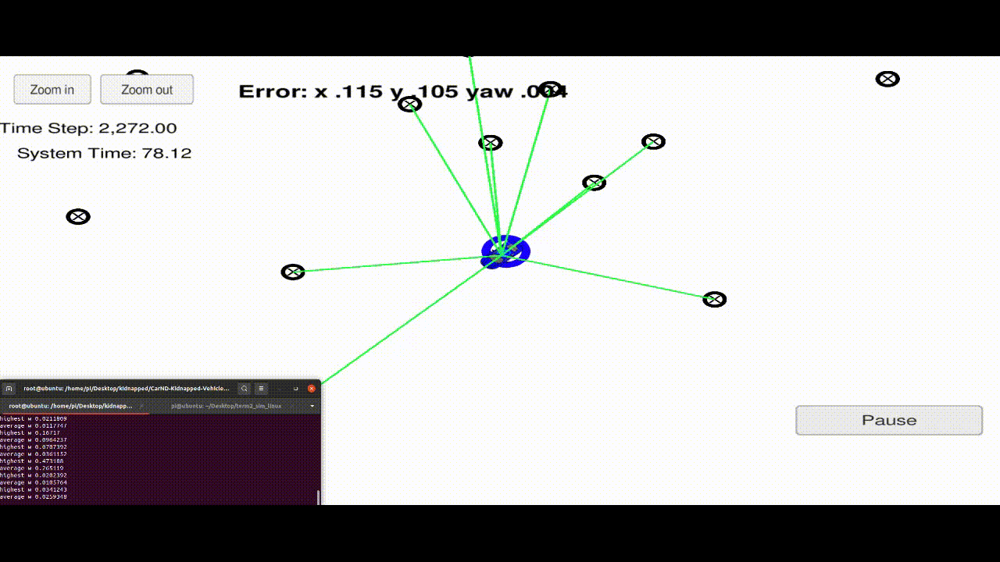

# CarND-Kidnapped-Vehicle-P3
Udacity Self-Driving Car Nanodegree - Kidnapped Vehicle project
# Overview
#### This repository contains all the code required to complete the final project of the Localization process of Udacity's Self-Driving Car Nanodegree.


## Introduction
Robot has been kidnapped and moved to a new location! Fortunately, it has maps of this location, GPS estimates of the initial location, and many (noise) sensors and control data.

This project implements a two-dimensional particle filter in C++. Particle filters provide maps and some initial location information (information similar to GPS). In each step, the filter also imports observation and control data.

## Prerequisites

The project has the following dependencies (from Udacity's seed project):

- cmake >= 3.5
- make >= 4.1
- gcc/g++ >= 5.4
- Udacity's simulator.

## Run this Code

This repository contains two files that can be use to set up and install uWebSocketIO in Linux or Mac. For windows, you can use Docker, VMware, or Windows 10 Bash to install the uWebSocketIO in Ubuntu.

Install on uWebSocketIO can be built by jumping on top of a completed main program and doing the following in the project's directory:

```
> mkdir build
> cd build
> cmake ..
> make
> ./particle_filter
```

In this project, Udacity's seed repo provides scripts that can be cleaned, compiled, and executed. The following commands must be executed in this repo directory:

```
> ./clean.sh
> ./build.sh
> ./run.sh
```

# Implementing the Particle Filter
The directory structure of this repository is as follows:

```
root
|   build.sh
|   clean.sh
|   CMakeLists.txt
|   README.md
|   run.sh
|
|___data
|   |   
|   |   map_data.txt
|   
|   
|___src
    |   helper_functions.h
    |   main.cpp
    |   map.h
    |   particle_filter.cpp
    |   particle_filter.h
```

The file that needs to be modified is particle_filter.cpp in the src directory. The file contains the scaffolding of the ParticleFilter class and several related methods. Read the code, comments, and header file particle_filter.h to understand what this code will do.

If you are interested, also look at src/main.cpp. This file contains code to actually execute particle filters and invoke related methods.

# Result
After finish this project, you found those results.

| RMSE | Result |
|------|-----------|
| x  |  0.115   |
| y  |  0.106   | 
| yaw  |  0.004   |
## START

## FINISH


## How to write a README
A well written README file can enhance your project and portfolio.  Develop your abilities to create professional README files by completing [this free course](https://www.udacity.com/course/writing-readmes--ud777).
